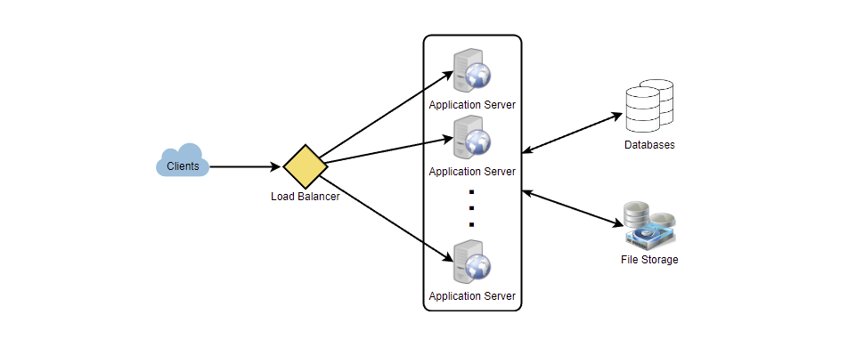

# System Design Interviews: A step by step guide

[Source](https://www.educative.io/courses/grokking-the-system-design-interview/B8nMkqBWONo)

## Step 1: Clarify Requirements

Given a task to re-design twitter, ask the following questions:

- Will users of our service be able to post tweets and follow other people?
- Should we also design to create and display the user’s timeline?
- Will tweets contain photos and videos?
- Are we focusing on the backend only, or are we developing the front-end too?
- Will users be able to search tweets?
- Do we need to display hot trending topics?
- Will there be any push notification for new (or important) tweets?

## Step 2: Estimate Scale

Ask the following questions to gauge the scale of the system:

- What scale is expected from the system (e.g., number of new tweets, number of tweet views, number of timeline generations per sec., etc.)?
- How much storage will we need? We will have different storage requirements if users can have photos and videos in their tweets.
- What network bandwidth usage are we expecting? This will be crucial in deciding how we will manage traffic and balance load between servers.

## Step 3: Define System Interfaces

This is where you can start to design the expected APIs within the system.

- `postTweet(user_id, tweet_data, tweet_location, user_location, timestamp, …)`
- `generateTimeline(user_id, current_time, user_location, …)`
- `markTweetFavorite(user_id, tweet_id, timestamp, …)`

## Step 4: Define Data Models

At this stage, you can design the data models that will be helpful when you later need to define the aspects of data management such as storage, transportation, encryption, etc. Also, this would be a good time to answer the best type of database to use (MySQL, NoSQL, etc)

- `User`: UserID, Name, Email, DoB, CreationDate, LastLogin, etc.
- `Tweet`: TweetID, Content, TweetLocation, NumberOfLikes, TimeStamp, etc.
- `UserFollow`: UserID1, UserID2
- `FavoriteTweets`: UserID, TweetID, TimeStamp

## Step 5: Design the System at a High-Level

The Twitter example could be drawn as such:

## Step 6: Explain the System Design

Now that you have detailed the system design at a high level, go deeper into explaining different aspects of your design.

- Since we will be storing a massive amount of data, how should we partition our data to distribute it to multiple databases? Should we try to store all the data of a user on the same database? What issue could it cause?
- How will we handle hot users who tweet a lot or follow lots of people?
- Since users’ timeline will contain the most recent (and relevant) tweets, should we try to store our data so that it is optimized for scanning the latest tweets?
- How much and at which layer should we introduce cache to speed things up?
- What components need better load balancing?

## Step 7: Identify and Resolve Bottlenecks

Locate and think about single points of failure, bottlenecks, or any other limitations to the system.

- Is there any single point of failure in our system? What are we doing to mitigate it?
- Do we have enough replicas of the data so that we can still serve our users if we lose a few servers?
- Similarly, do we have enough copies of different services running such that a few failures will not cause a total system shutdown?
- How are we monitoring the performance of our service? Do we get alerts whenever critical components fail or their performance degrades?
